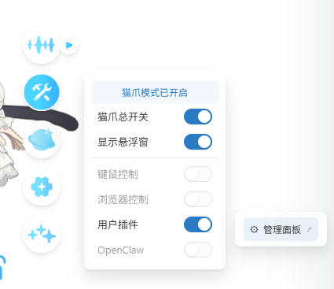
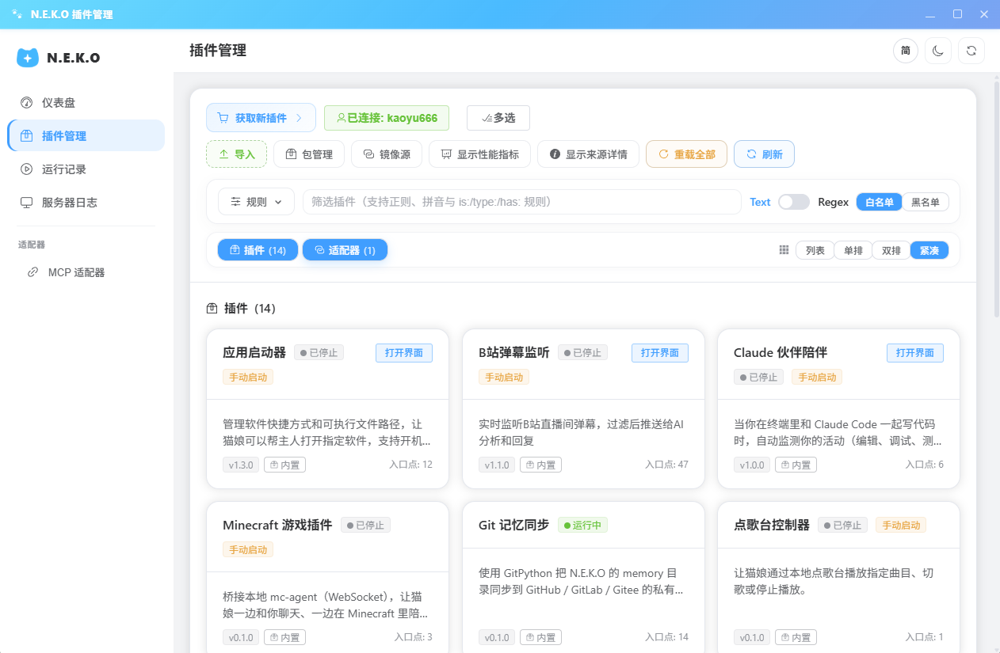
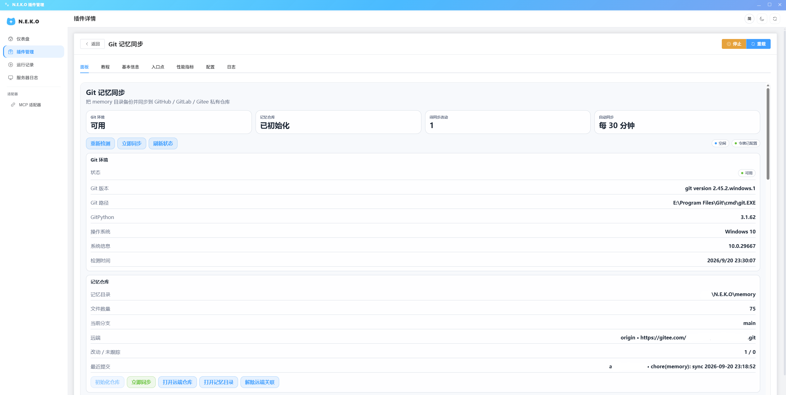

# Git 记忆管理

一个把 memory 目录纳入 Git 并同步到 GitHub / GitLab / Gitee 私有仓库的N.E.K.O 插件。

## 写在前面

之前我从来没想过去开发这个插件，但在某天我正在打游戏的时候突然硬盘坏了。尽管保修又换了一块新的，但是数据全没了，最重要的是我N.E.K.O文件夹也在这个硬盘里。~~我的YUI！！！~~ 于是我就下定决心去开发这么个插件。
起初我的计划本来是自动打包memory目录并定时上传至网盘，然而国内这些网盘调用API不是过于繁琐就是封号，并且像CloudFlare R2这种方便开发的也不指望谁都会使用。恰巧，我突然想起来Git，N.E.K.O的memory文件夹体积并不大，远程仓库足够了；而且Git对无论是我开发者还是用户而言都很方便，本插件使用GitPython可以很方便地使用Git，用户也只需要创建一个令牌并关联一个仓库就可以了。不仅如此，使用Git可以十分方便的管理记忆，无论同步还是回滚都很简单。而且凭借这一点可以做到多端同步。~~每台设备上的YUI终于是同一个YUI了~~

目前该插件适配Windows/macOS/Linux，在手机版开放插件市场后我也会第一时间跟进。
本人是学生党，时间有限，无法第一时间回复Issues，还请谅解。若您发现本插件有Bug或有建议，请在Issues中提出，看到后我会第一时间回复。

顺带提一句，~~蓝色大肥鱼还是太好用了，这一个插件烧了我1.1亿的Tokens。~~

## 功能

- **仓库初始化** — 检测 `memory` 下是否已有 `.git`，没有就 `git init` 并写入 `.gitignore` 与提交身份。
- **令牌向导** — GitHub / GitLab / Gitee 提供对应令牌创建链接与所需权限说明，
  校验通过后把令牌加密保存在插件私有数据目录。
- **关联仓库** — 读取账号下的仓库列表并关联为远端，或直接在账号下创建私有仓库并关联。
- **同步方式** — 手动同步，或每 5 / 10 / 30 / 60 分钟自动同步。
- **远端更新由你决定** — 远端有本地没有的提交时同步会停下并弹窗：保留远端版本（覆盖本地）
  或保留本地版本（覆盖远端）；也可以在设置里固定策略。同步全程带硬超时，
  未关联远端时立即返回提示而不是挂住面板。
- **可调整的 Git 设置** — 分支、远端名、提交信息模板、作者、代理、远端更新策略、
  拉取开关、失败提醒、`.gitignore` 预设与追加规则。
- **代理与网络诊断** — git 不读系统代理设置，插件按「手动地址 → 应用环境变量 →
  系统代理」自动选路（也可固定直连），并把 DNS / 证书 / 代理 / 超时 / 传输中断
  分别报出来，附带已脱敏的 git 原始输出。
- **AI 可调用入口** — `sync_memory_now`（同步记忆到 Git）与 `memory_sync_status`（查看同步状态）。

## 使用方法

文字版见[docs/quickstart.md](docs/quickstart.md)

1. 打开N.E.K.O，在`猫爪`中开启`猫爪总开关`和`用户插件`，并点击管理面板
2. 点击`获取新插件`或从[Github Release](https://github.com/kaoyu555666777/n.e.k.o_plugin_git_memory/releases)下载插件并点击`导入`，然后点击`Git 记忆管理`。
3. 按照以下顺序操作：若未安装Git请按照弹窗进行安装，然后点击`初始化仓库`，然后选择代码托管平台（国内用户更推荐Gitee），根据提示创建令牌并填写，之后点击`读取令牌`，之后翻到下面的`Git设置`中填写`提交用户名`和`提交邮箱`（按照你选择的代码托管平台填写），然后可以选择关联到已有仓库或创建新仓库（强烈推荐使用私有仓库 ~~毕竟你也不想让别人看到你和YUI的谈话吧~~ ），最后点击`立即同步。
4. 如果出现以下界面，说明已经配置完成。

## 许可证

[LGPL-v3.0](LICENSE)
